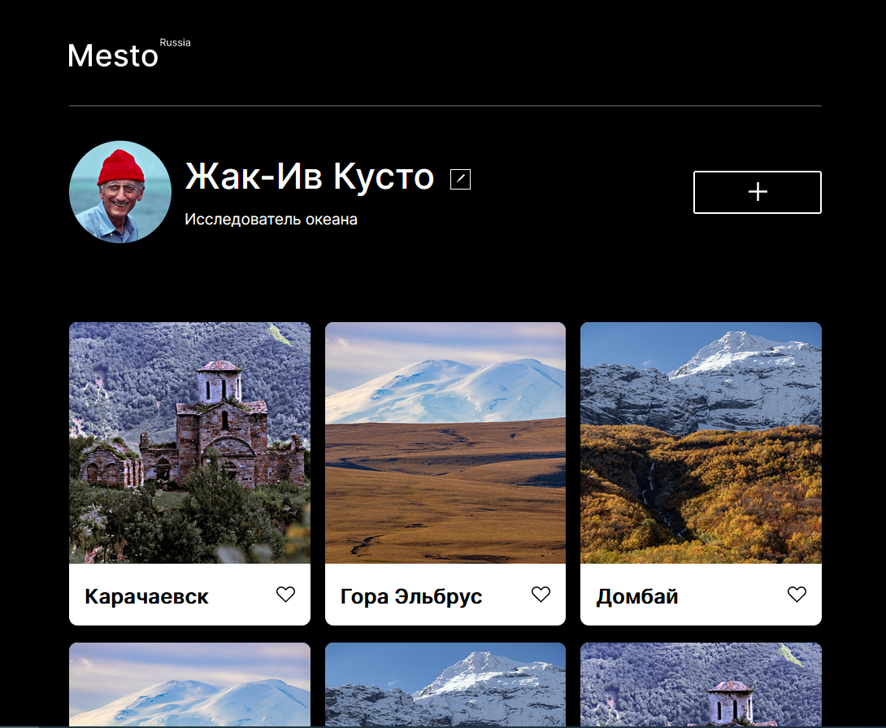
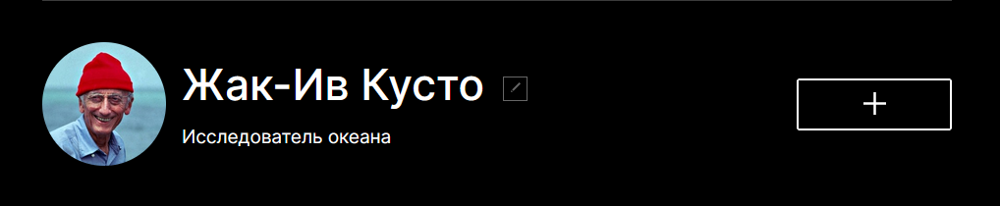
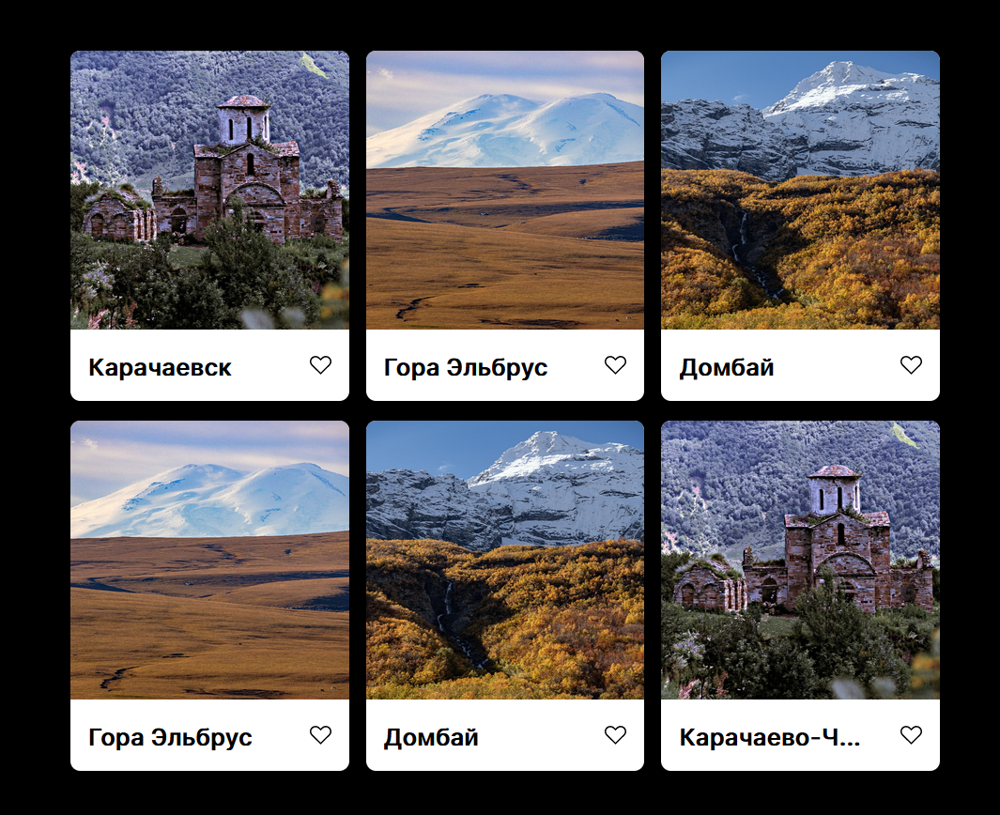
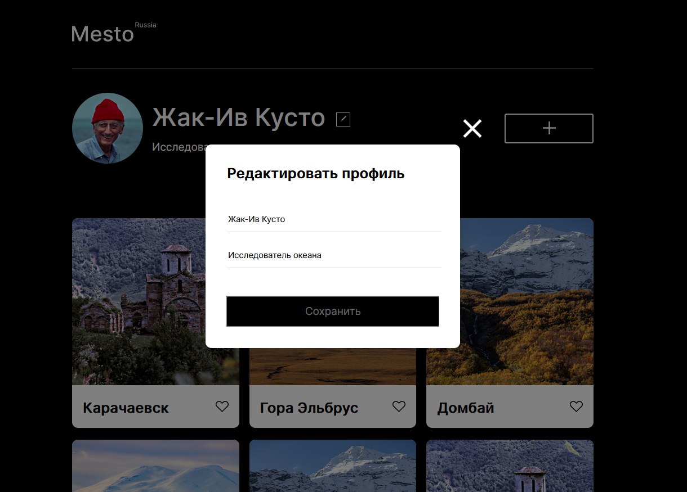

# Проект: [Место](https://ilya-74.github.io/mesto/index.html)

### Обзор

* Profile
* Cards-grid
* Popup

__<h2 align="center">Mesto</h2>__
_
Здесь проект Mesto.
_

__<h2 align="center">Profile</h2>__
_
В профиле, есть кнопка редактировать, ею вызывается окно формы.
_

__<h2 align="center">Cards-grid</h2>__
_
В Фото-грид размещен блок, с картинками, которые расположены в грид среде.
_

__<h2 align="center">Popup</h2>__
_
Реализован сам popup с кнопкой закрыть, сохранить. И реализованы поля для ввода текста на языке js.
_

Удачи!
[__
Вверх
__](#anchor)